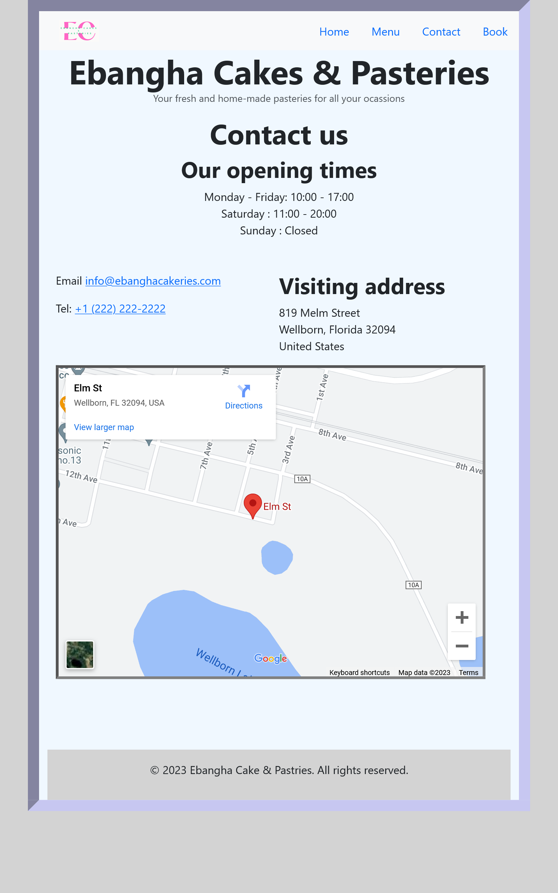

# Programming With Berns 
## Project Description for Web Development With CSS3

## Project Description

This project is a build up on the [HTML5 project](https://github.com/programmingwithberns/webprogramming/tree/master/html5-project). Re-use your HTML code and add CSS styles to it. 

*I have added the files and [instructions](instructions-on-how-to-build-the-html-project.pdf) on how to build the project here for those who want to start it from scratch.*

The student is expected to build upon the project with css. 

The student should be able to 

- Link an external CSS file to an HTML page
- Practically use CSS for styling texts, images, hyperlinks, tables, forms, and other HTML elements
- Use bootstrap to style their web pages

It is expected that the student shall use their already coded HTML5 project and add CSS to it. 

All resources are allowed but no human help is allowed. 

Expected duration: 1 - 4 weeks. 

## Grading criteria 
- Website should have valid HTML5 code
- Website should be responsive (See images below)
- Website should be published on GitHub as a Github page

***Use these as inspirations for your project. Strive to make something better***
<table style="border:1px solid black; border-collapse:collapse; width: 100%; text-align: center;">
<caption>Sample pages  </caption>
<thead>
<tr >
 <th style="text-align:center;"> Large Screen </th>
 <th style="text-align:center;"> Small Screen </th>
</tr>
</thead>
<tbody>
<tr>
<td> Home   </td>

<td> Home  </td>
</tr>
<tr>
<td> Menu   </td>

<td> Menu  </td>
</tr>
<tr>
<td> Contact   </td>

<td> Contact  </td>
</tr>
<tr>
<td> Booking   </td>

<td> Booking  </td>
</tr>
</tbody>
</table>

Good luck